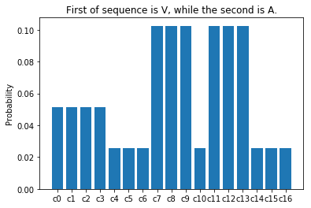

# BioInfoPlus

## get datas from bioinformation databases

use `./download/dsspGet.py`.  
see configurations at `./download/dsspPKU.json`.
```
python dsspGet.py dsspPKU.json
```

## Process datas into dataframes

```python
from preprocess.BioParser import bio_parse
dataframe = bio_parse('./dssp/sources/1a00.dssp')
AA = dataframe.AA # amino acid
Structure = dataframe.STRUCTURE # secondary structure
```


## Check the frequency distribution of specific known pattern

```python
cases = np.array([AA, Structure]).T
res =  [each_gram.T.flatten() for each_gram in cython_make_gram(cases, 5)]
from research.specific_regular import specific_report
frequency = specific_report(res, {1:'A', 2:'A'})
print(frequency.values())
```


## An example about biological sequence detection

- [Codes](./main.py)

- [](./simple.png)

Explanation:
```
c1 :
 ('V',  # 1-st amino acid.
  'A',  # 2-nd amino acid.
  'D',  # ...
  'A',  # ...
  'L',  # ...
  'H  X S+  ',  # 1-st secondary structure
  'H  X S+  ',  # ...
  'H  X S+  ',  # ...
  'H  X S+  ',  # ...
  'H  X S+  '   # 5-th secondary structure
  ),
c2 :
    ...
```